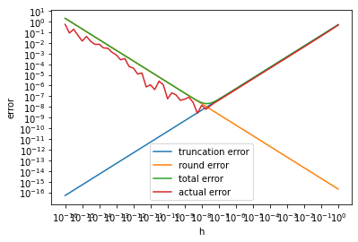

# 数值分析 实验1
2019011265 计93 丁韶峰

## 上机题1

### 实验内容

编程实现例1.4，绘出图1.2，体会截断误差和舍入误差对结果的不同影响。

### 实验过程

用 Python 实现。首先引入必要的包：


```python
import numpy as np
import matplotlib.pyplot as plt

```

根据例题定义常数如下：


```python

M = 1
eps = 1e-16
```

定义计算截断误差，舍入误差，总误差限，实际误差的四个函数：


```python
def truncation_err(h):
  return M * h / 2

def round_err(h):
  return 2 * eps / h

def total_err(h):
  return truncation_err(h) + round_err(h)

def actual_err(h):
  return np.abs((np.sin(1 + h) - np.sin(1)) / h - np.cos(1))
```

生成绘图所需的数据：


```python
x = [10 ** (i / 4) for i in range(-64, 1)]

truc_err = [truncation_err(h) for h in x]
rd_err = [round_err(h) for h in x]
tot_err = [total_err(h) for h in x]
act_err = [actual_err(h) for h in x]
```

用`matplotlib`进行绘图:


```python
plt.xscale("log")
plt.yscale("log")
plt.xticks([10 ** i for i in range(-16, 1)])
plt.yticks([10 ** i for i in range(-16, 2)])
plt.xlabel("h")
plt.ylabel("error")
plt.plot(x, truc_err, label="truncation error")
plt.plot(x, rd_err, label="round error")
plt.plot(x, tot_err, label="total error")
plt.plot(x, act_err, label="actual error")
plt.legend()
plt.show()
```


    

    


### 实验结论

从图像中可以看出，总误差在 $h = 10^{-8}$ 时取最小值，符合理论分析。当步长较小时，舍入误差占主导地位；当步长较大时，截断误差占主导地位。

## 上机题3

### 实验内容

分别用单精度浮点数计算调和级数，进行相应分析。用双精度浮点数评估计算误差，并估算双精度浮点数的计算时间。

### 实验过程

计算单精度浮点数下使结果不再变换的 $n$：


```python
n = 1
res_f32 = np.float32(0)
while True:
  new_res_f32 = np.float32(res_f32 + 1 / np.float32(n))
  if (new_res_f32 == res_f32):
    break
  n += 1
  res_f32 = new_res_f32

print(n)
print(res_f32)
```

    2097152
    15.403683


理论上，有
$
\frac{1}{n} \le \frac{1}{2} \epsilon_{mach} \Sigma_{k = 1}^{n-1} \frac{1}{k}$ 时，结果不再变化。进行如下计算，求出n的理论值：


```python
n = 1
res = np.float32(0)
eps = 5.96e-8
while True:
  n_inv = np.float32(1 / np.float32(n))
  if n_inv < eps * res / 2:
    break
  res += n_inv
  n += 1

print(n)
```

    2178509


比实际值略大。这是因为在计算$n$的理论值时也存在截断误差和舍入误差。

用双精度浮点数进行计算，评估误差：


```python
n_f32 = 2097152
n_f64 = 1
res_f64 = np.float64(0)
while n_f64 <= n_f32:
  res_f64 += np.float64(1 / np.float64(n_f64))
  n_f64 += 1

absolute_err = np.abs(res_f64 - res_f32)
relative_err = absolute_err / res_f64

print("absolute error: {}, relative error: {}".format(absolute_err, relative_err))
```

    absolute error: 0.270376013662041, relative error: 0.017866287858289122


由于双精度浮点数足够精确，可以将调和级数取极限，当
$
\frac{1}{n} \le \frac{1}{2} \epsilon_{mach} (\ln n + \gamma + \frac{1}{2n})$时结果不再变化。进行计算！


```python
from scipy.optimize import fsolve

def f(n):
  eps = 1.11e-16
  return eps / 2 * (np.log(n) + np.euler_gamma + 1 / (2 * n)) - 1 / n

x = fsolve(f, [1])
print(x)
```

    [5.22756089e+14]


可得结果如上。Jupyter Notebook 中使用 python 进行单精度的计算花费 12s，据此估算双精度收敛的时间：


```python
x[0] / n_f32 * 12.2 / 3600 / 24
```


    35197.780580782404


单位为天，需要九十多年才能收敛。

### 实验结论

计算机中的浮点数表示存在误差，会导致计算很小或很大的数时出现上溢或下溢的问题，需要注意这一点，合理调整运算顺序，避免出现大数吃小数，溢出等问题。同时，在时间允许的情况下，可以尽量使用精度更高的浮点数来进行运算。
